<p align="center">
  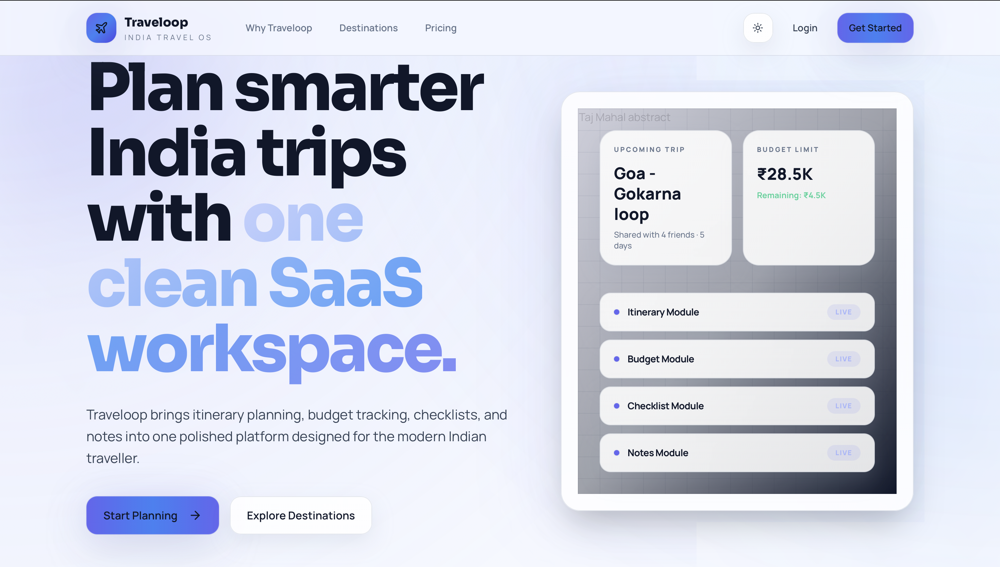
</p>

<h1 align="center">✈️ Traveloop</h1>

<p align="center">
  <strong>Plan trips. Build itineraries. Travel smarter.</strong>
</p>

<p align="center">
  A modern, full-stack travel planning platform that helps you organize every detail of your next adventure — from destinations and daily activities to budgets, packing lists, and shareable trip links.
</p>

<p align="center">
  
  
  
  
  
  
  
  
</p>

<p align="center">
  <a href="#-features">Features</a> •
  <a href="#-screenshots">Screenshots</a> •
  <a href="#%EF%B8%8F-architecture">Architecture</a> •
  <a href="#-installation--setup">Setup</a> •
  <a href="#-usage">Usage</a> •
  <a href="#-api-endpoints">API</a> •
  <a href="#-contributing">Contributing</a>
</p>

---

## ✨ Features

- **🗺️ Trip Management** — Create, edit, and organize trips with dates, cover images, and budget limits
- **📍 Multi-Destination Itineraries** — Add multiple cities per trip with arrival/departure tracking
- **📅 Day-by-Day Planner** — Auto-generated daily itinerary blocks with drag-and-drop activities
- **💰 Budget Tracker** — Set limits, log costs per activity, and monitor spending across categories
- **✅ Packing Checklist** — Categorized packing lists (clothing, documents, electronics, etc.)
- **📝 Trip Notes** — Attach notes to any trip for quick references and reminders
- **🔗 Public Sharing** — Generate unique share links for read-only trip views
- **🔐 Secure Auth** — JWT-based authentication with email OTP verification
- **🔍 Search & Discover** — Browse and search across your trips and destinations
- **👤 User Profiles** — Personalized profiles with trip history
- **🐳 Dockerized** — One-command setup with Docker Compose for the full stack

---

## 📸 Screenshots

<details>
<summary><strong>🏠 Landing Page</strong></summary>
<br />

> The entry point — clean hero section with feature highlights to onboard new users.

| Landing | Features |
|---------|----------|
|  |  |

</details>

<details>
<summary><strong>🔐 Authentication</strong></summary>
<br />

> Secure registration and login with email OTP verification.

| Register | Login |
|----------|-------|
| 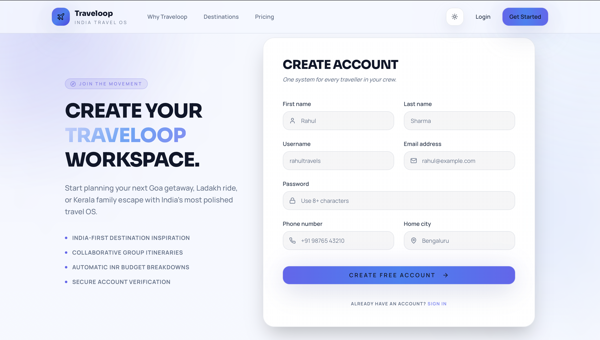 | 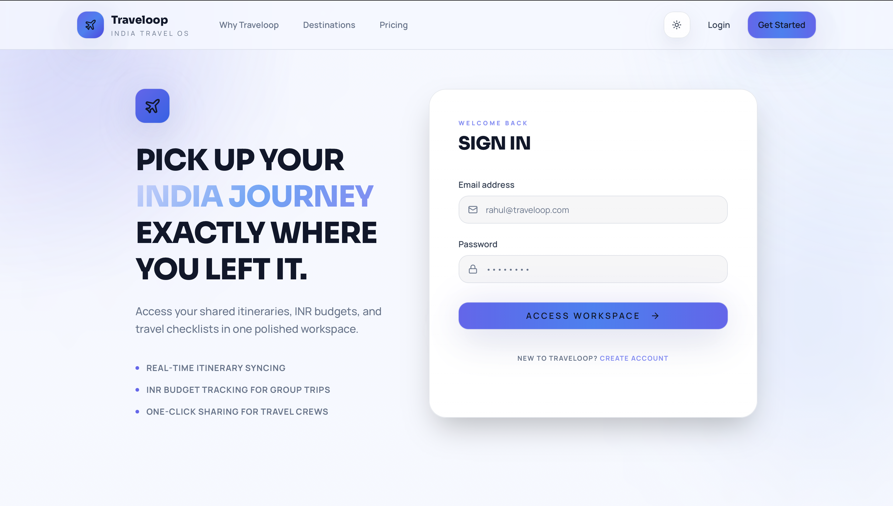 |

</details>

<details>
<summary><strong>📊 Dashboard & Trips</strong></summary>
<br />

> Central hub showing all your trips, suggestions, and quick actions.

| Dashboard | My Trips |
|-----------|----------|
| 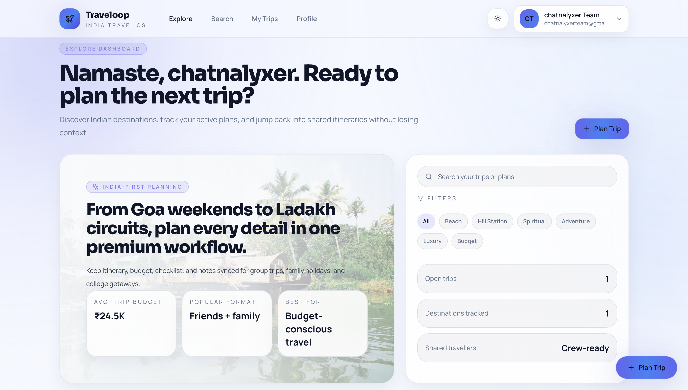 | 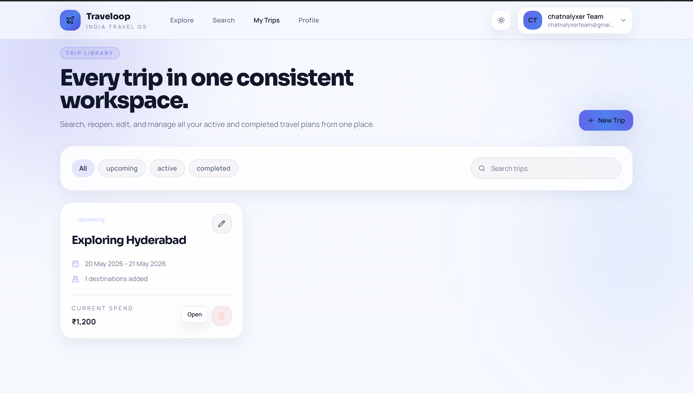 |

| Create Trip | Search |
|-------------|--------|
| 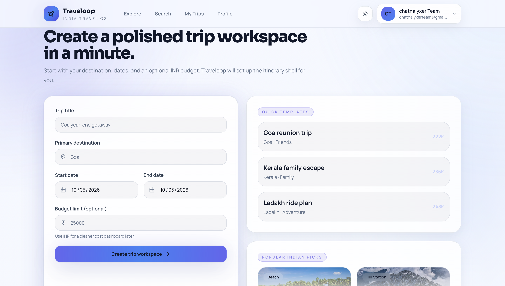 | 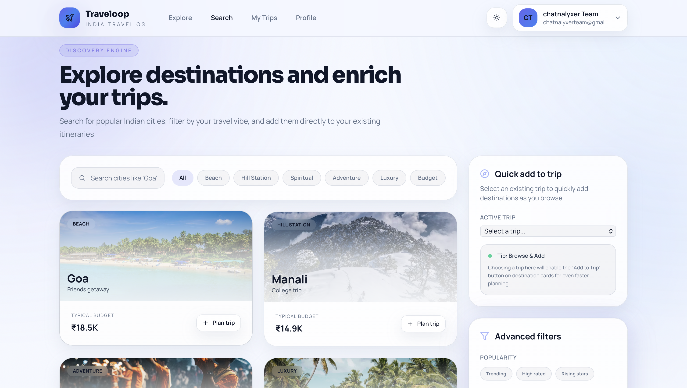 |

</details>

<details>
<summary><strong>🗓️ Itinerary Builder</strong></summary>
<br />

> The core experience — build day-by-day itineraries with destinations and activities.

| Itinerary Builder | Activities |
|-------------------|------------|
| 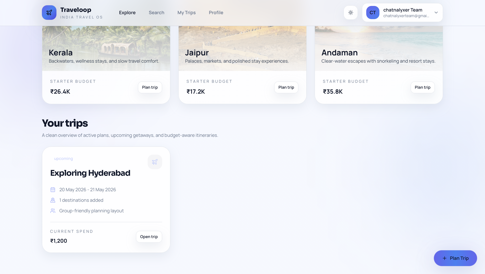 |  |

| Itinerary View | Itinerary Preview |
|----------------|-------------------|
| 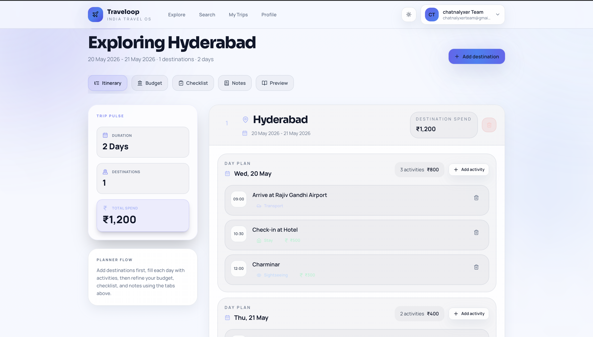 | 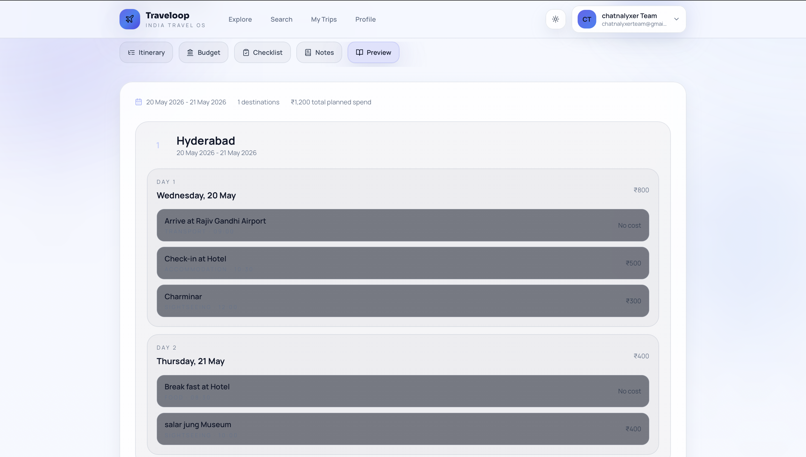 |

</details>

<details>
<summary><strong>💰 Budget & Extras</strong></summary>
<br />

> Track spending, manage packing lists, and jot down trip notes.

| Budget Tracker | Packing Checklist |
|----------------|-------------------|
| 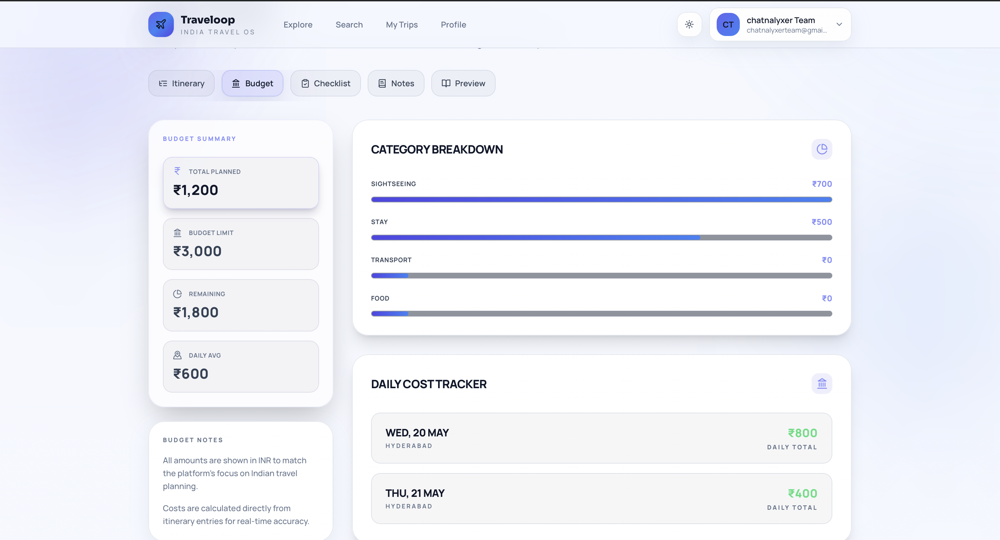 | 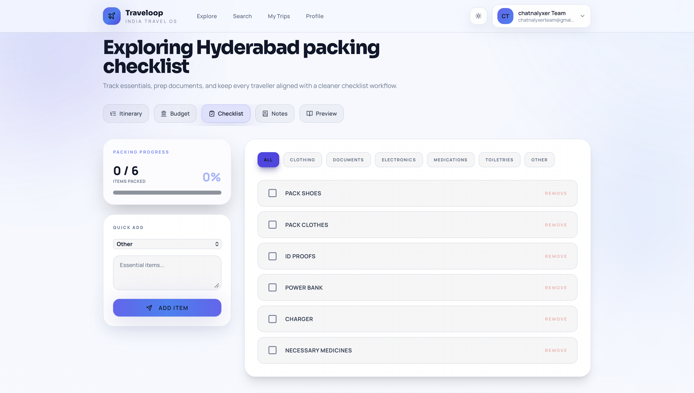 |

| Trip Notes |
|------------|
| 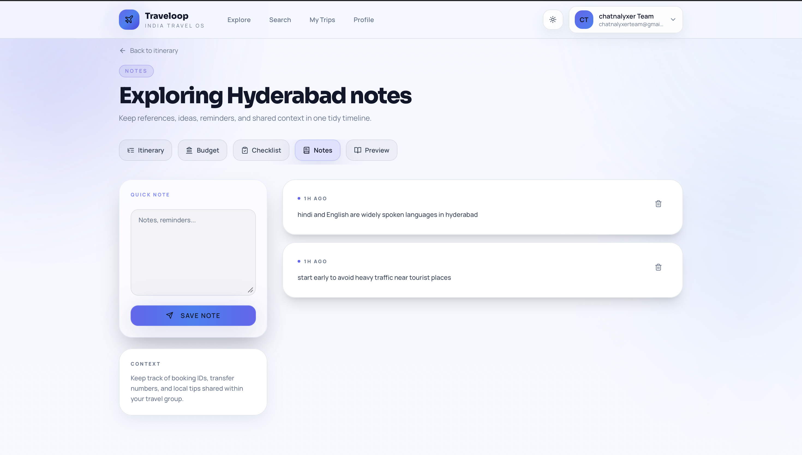 |

</details>

<details>
<summary><strong>👤 Profile</strong></summary>
<br />

| Profile |
|---------|
| 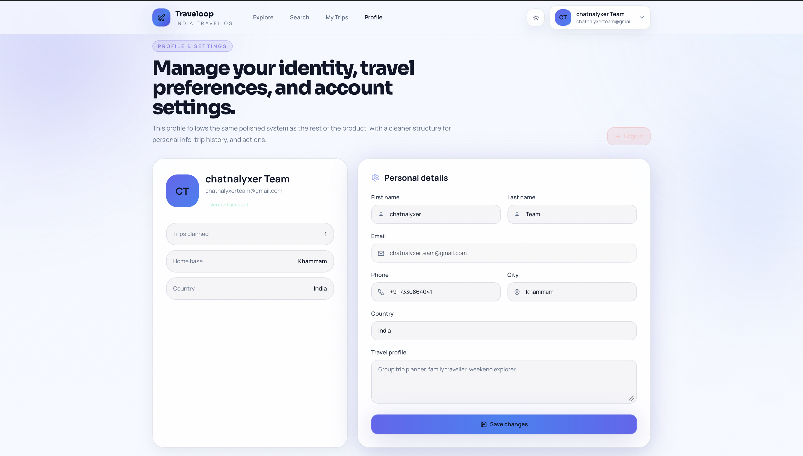 |

</details>

---

## 🏗️ Architecture

```
┌──────────────────────────────────────────────────────────┐
│                       Client (Browser)                   │
│                  React 18 + Vite + Tailwind              │
│          React Router • React Query • Axios              │
└────────────────────────┬─────────────────────────────────┘
                         │  HTTP / REST
                         ▼
┌──────────────────────────────────────────────────────────┐
│                    API Gateway (:8000)                    │
│              Django + Django REST Framework               │
│         JWT Auth • CORS • Serializers • ViewSets         │
├──────────────────────────────────────────────────────────┤
│  /api/auth/    →  Users App  (Register, Login, OTP)      │
│  /api/         →  Trips App  (Trips, Destinations, etc.) │
│  /api/share/   →  Public Trip Views (No Auth)            │
└────────────────────────┬─────────────────────────────────┘
                         │  psycopg2
                         ▼
┌──────────────────────────────────────────────────────────┐
│                  PostgreSQL 15 (Alpine)                   │
│          Persistent volume • Health checks               │
└──────────────────────────────────────────────────────────┘
```

**Key design decisions:**
- **UUID primary keys** across all models for security and portability
- **Auto-generated itinerary days** — adding a destination automatically creates day entries for the date range
- **Share tokens** — each trip gets a unique cryptographic token for public sharing
- **Categorized activities** — food, sightseeing, transport, accommodation, shopping, nightlife

---

## ⚙️ Installation & Setup

### Prerequisites

- [Docker](https://docs.docker.com/get-docker/) & [Docker Compose](https://docs.docker.com/compose/install/)
- Git

### Quick Start (Docker — Recommended)

```bash
# Clone the repository
git clone https://github.com/Aishwarya-kyatham/Traveloop.git
cd Traveloop

# Configure environment
cp .env.example .env
# Edit .env with your values (see Environment Variables below)

# Launch the full stack
docker compose up --build
```

That's it. Three containers spin up automatically:

| Service    | URL                                                        | Description          |
|------------|------------------------------------------------------------|----------------------|
| Frontend   | [http://localhost:5173](http://localhost:5173)              | React application    |
| Backend    | [http://localhost:8001/api/](http://localhost:8001/api/)    | REST API             |
| Admin      | [http://localhost:8001/admin/](http://localhost:8001/admin/)| Django admin panel   |

### Manual Setup

<details>
<summary><strong>Backend (Django)</strong></summary>

```bash
cd backend

# Create virtual environment
python -m venv .venv
source .venv/bin/activate

# Install dependencies
pip install -r requirements.txt

# Run migrations
python manage.py makemigrations users
python manage.py migrate

# Create admin account
python manage.py createsuperuser

# Start server
python manage.py runserver
```

</details>

<details>
<summary><strong>Frontend (React)</strong></summary>

```bash
cd frontend

# Install dependencies
npm install

# Start dev server
npm run dev
```

</details>

---

## 🔐 Environment Variables

Create a `.env` file in the project root:

```env
# ── Django ────────────────────────────────────────────
SECRET_KEY=your-secret-key-here
DEBUG=True
ALLOWED_HOSTS=localhost,127.0.0.1,backend

# ── PostgreSQL ────────────────────────────────────────
POSTGRES_DB=traveloop_db
POSTGRES_USER=postgres
POSTGRES_PASSWORD=postgres
DB_HOST=db
DB_PORT=5432

# ── Frontend ─────────────────────────────────────────
VITE_API_URL=http://localhost:8001/api

# ── Email (SMTP) ─────────────────────────────────────
EMAIL_BACKEND=django.core.mail.backends.smtp.EmailBackend
EMAIL_HOST=smtp.gmail.com
EMAIL_PORT=587
EMAIL_USE_TLS=True
EMAIL_HOST_USER=your-email@gmail.com
EMAIL_HOST_PASSWORD=your-app-password
DEFAULT_FROM_EMAIL=your-email@gmail.com
```

> **Note:** For Gmail SMTP, generate an [App Password](https://support.google.com/accounts/answer/185833) instead of using your account password.

---

## 🚀 Usage

### Getting Started

1. **Register** an account from the landing page
2. **Verify** your email with the OTP sent to your inbox
3. **Create a trip** — set title, dates, and optionally a budget limit
4. **Add destinations** — cities you'll visit with arrival/departure dates
5. **Plan activities** — add activities to each day with time, category, and cost
6. **Track your budget** — monitor spending vs. your limit in real-time
7. **Share your trip** — generate a public link for friends and family

### Docker Commands

```bash
# Start all services
docker compose up --build

# Stop all services
docker compose down

# View logs (all services)
docker compose logs -f

# View logs (specific service)
docker compose logs -f backend

# Run migrations
docker compose exec backend python manage.py migrate

# Create superuser
docker compose exec backend python manage.py createsuperuser

# Rebuild a single service
docker compose build frontend
```

---

## 📁 Folder Structure

```
Traveloop/
├── backend/
│   ├── apps/
│   │   ├── users/                # Auth, registration, OTP, profiles
│   │   │   ├── models.py
│   │   │   ├── serializers.py
│   │   │   ├── views.py
│   │   │   └── urls.py
│   │   ├── trips/                # Core travel engine
│   │   │   ├── models.py        # Trip, Destination, Day, Activity, Notes, Packing
│   │   │   ├── serializers.py
│   │   │   ├── views.py
│   │   │   └── urls.py
│   │   └── health_views.py
│   ├── config/                   # Django settings, root URLs, WSGI
│   ├── Dockerfile
│   ├── requirements.txt
│   └── manage.py
├── frontend/
│   ├── src/
│   │   ├── pages/                # Route-level components
│   │   │   ├── Landing.jsx
│   │   │   ├── Dashboard.jsx
│   │   │   ├── CreateTrip.jsx
│   │   │   ├── ItineraryView.jsx
│   │   │   ├── BudgetView.jsx
│   │   │   ├── Checklist.jsx
│   │   │   ├── TripNotes.jsx
│   │   │   ├── Search.jsx
│   │   │   ├── Profile.jsx
│   │   │   └── ...
│   │   ├── components/           # Reusable UI components
│   │   │   ├── ui/              # Base elements (buttons, inputs)
│   │   │   ├── layout/          # Navbar, layout wrappers
│   │   │   ├── trip/            # Trip cards, forms
│   │   │   └── itinerary/       # Day blocks, activity items
│   │   ├── services/             # API client layer
│   │   │   ├── api.js           # Axios config + interceptors
│   │   │   ├── tripService.js
│   │   │   ├── itineraryService.js
│   │   │   ├── checklistService.js
│   │   │   ├── notesService.js
│   │   │   └── userService.js
│   │   ├── context/              # React context providers
│   │   ├── hooks/                # Custom React hooks
│   │   ├── router/               # Route definitions
│   │   └── lib/                  # Utilities
│   ├── Dockerfile
│   ├── vite.config.js
│   ├── tailwind.config.js
│   └── package.json
├── docs/
│   ├── images/                   # Screenshots and assets
│   ├── phase_plan.md
│   └── docker_notes.md
├── docker-compose.yml
├── .env
└── .gitignore
```

---

## 🧪 API Endpoints

### Authentication

| Method | Endpoint               | Description              | Auth |
|--------|------------------------|--------------------------|------|
| POST   | `/api/auth/register/`  | Create new account       | ✗    |
| POST   | `/api/auth/verify-otp/`| Verify email OTP         | ✗    |
| POST   | `/api/auth/resend-otp/`| Resend verification OTP  | ✗    |
| POST   | `/api/auth/login/`     | Obtain JWT tokens        | ✗    |
| POST   | `/api/auth/login/refresh/` | Refresh access token | ✗    |
| GET    | `/api/auth/me/`        | Get current user profile | ✓    |

### Trips

| Method | Endpoint               | Description              | Auth |
|--------|------------------------|--------------------------|------|
| GET    | `/api/trips/`          | List user's trips        | ✓    |
| POST   | `/api/trips/`          | Create a new trip        | ✓    |
| GET    | `/api/trips/{id}/`     | Get trip details         | ✓    |
| PUT    | `/api/trips/{id}/`     | Update trip              | ✓    |
| DELETE | `/api/trips/{id}/`     | Delete trip              | ✓    |

### Itinerary

| Method | Endpoint                  | Description                | Auth |
|--------|---------------------------|----------------------------|------|
| GET    | `/api/destinations/`      | List destinations for trip | ✓    |
| POST   | `/api/destinations/`      | Add destination to trip    | ✓    |
| GET    | `/api/days/`              | List itinerary days        | ✓    |
| GET    | `/api/activities/`        | List activities            | ✓    |
| POST   | `/api/activities/`        | Add activity to a day      | ✓    |
| PUT    | `/api/activities/{id}/`   | Update activity            | ✓    |
| DELETE | `/api/activities/{id}/`   | Remove activity            | ✓    |

### Extras

| Method | Endpoint                   | Description               | Auth |
|--------|----------------------------|---------------------------|------|
| GET    | `/api/checklist/`          | Get packing checklist     | ✓    |
| POST   | `/api/checklist/`          | Add packing item          | ✓    |
| PATCH  | `/api/checklist/{id}/`     | Toggle item checked       | ✓    |
| GET    | `/api/notes/`              | Get trip notes            | ✓    |
| POST   | `/api/notes/`              | Add a note                | ✓    |
| DELETE | `/api/notes/{id}/`         | Delete a note             | ✓    |
| GET    | `/api/share/{token}/`      | Public trip view          | ✗    |

---

## 🤝 Contributing

Contributions are welcome! Here's how to get started:

```bash
# Fork the repository
# Clone your fork
git clone https://github.com/your-username/Traveloop.git

# Create a feature branch
git checkout -b feat/your-feature-name

# Make your changes and commit
git commit -m "feat: add your feature description"

# Push and open a Pull Request
git push origin feat/your-feature-name
```

**Guidelines:**
- Follow the existing code style and project structure
- Write descriptive commit messages using [Conventional Commits](https://www.conventionalcommits.org/)
- Ensure Docker setup works before submitting
- Update documentation for any new features

---

## 📄 License

This project is licensed under the [MIT License](LICENSE).

---

<p align="center">
  Built with ❤️ by the Traveloop team
</p>
